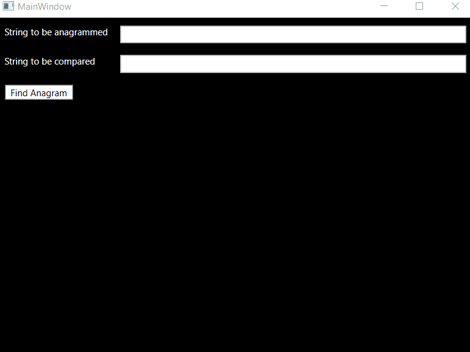

# WpfAnagram

This is a WPF application which helps you to get all the anagrams for a string and then figures out whether or not one of the anagrams is part of the other string. Check out the demo below!
\
\
\
\

\
# How to run

1. Clone the repository to your desktop.
2. Open the solution file (Anagram.sln) with Visual Studio.
3. Run the application within Visual Studio.
